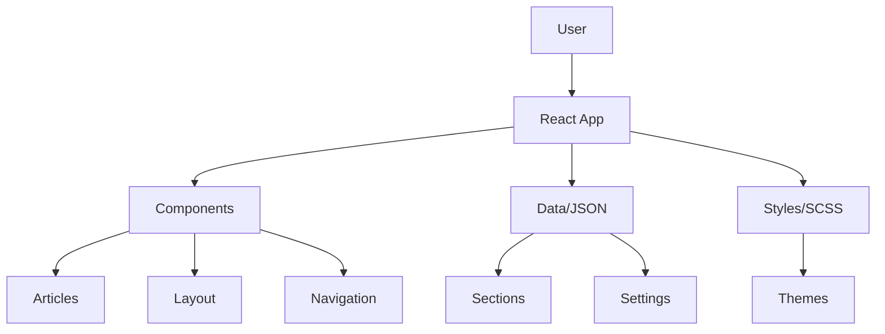

# 🚀 Thomas Butler - Commercial Portfolio

<div align="center">


  
  <h3>Full-Stack Developer | Liverpool, England</h3>
  
  [](https://www.thomasjbutler.me/)
  [](https://github.com/ThomasJButler)
  [](https://www.linkedin.com/in/thomasbutleruk/)

</div>

---

## 🎯 Overview

Welcome to my commercial portfolio! This is more than just a CV - it's a showcase of my journey as a web developer with **3+ years of experience** in full-stack development. Built with React and powered by the latest v2.0 template architecture, this portfolio demonstrates my expertise in modern web technologies and commitment to clean, performant code.

[](https://github.com/ThomasJButler/Commercial-Portfolio-React/actions)
[](https://opensource.org/licenses/MIT)
[](https://nodejs.org)
[](https://reactjs.org)

### 🛠️ Tech Stack
- **Frontend**: React, JavaScript, SCSS, HTML5/CSS3
- **Backend**: Node.js, .NET, C#
- **Cloud**: Azure, AWS
- **CMS**: HubSpot, Umbraco
- **Tools**: Git, Vite, TypeScript
- **AI/ML**: PyTorch, TensorFlow, Python

## ✨ Features

- 🎨 **Modern Design**: Clean, minimalist Apple-inspired aesthetic
- 📱 **Fully Responsive**: Optimized for all devices and screen sizes
- 🚀 **Performance First**: Lazy loading, optimized assets, 90+ Lighthouse score
- 🌓 **Theme Switching**: Elegant light/dark mode with smooth transitions
- 🔍 **SEO Optimized**: Full meta tags and structured data
- ♿ **Accessible**: WCAG compliant with semantic HTML
- 🌐 **Multi-language**: Support for EN, ES, FR, JA, RU, and more

## 🤝 Acknowledgments

This portfolio is built upon the excellent [React Portfolio Template](https://github.com/ryanbalieiro/react-portfolio-template) by **Ryan Balieiro**. I've extensively customized and migrated it to v2.0 while adding personal touches and improvements.

### Special Thanks
- Ryan Balieiro for the original template
- All my clients who provided testimonials
- The open-source community


## 🏆 Portfolio Highlights

### Web Agency Projects
- **M&S Bank Arena** - Enterprise venue management system
- **Merseyrail** - Public transport information platform
- **CDW** - Technology solutions provider website
- **ACC Liverpool** - Convention center digital presence

### Freelance Work
- **KC Roofing and Building** - Local business transformation
- **Annabel Butler Designs** - E-commerce creative portfolio

### Personal Projects
- **AiTomatic** - AI integration showcase
- **Matrix Arcade** - Interactive gaming experience
- **Personal Portfolio** - Hand-crafted from scratch

## 🚀 Getting Started

### Prerequisites

Before you begin, ensure you have the following installed:
- **Node.js** (v18.0.0 or higher) - [Download](https://nodejs.org/)
- **npm** (v9.0.0 or higher) - Comes with Node.js
- **Git** - [Download](https://git-scm.com/)

### Installation

```bash
# Clone the repository
git clone https://github.com/ThomasJButler/Commercial-Portfolio-React.git

# Navigate to project directory
cd Commercial-Portfolio-React

# Install dependencies
npm install

# Start development server
npm run dev

# Build for production
npm run build

# Preview production build
npm run preview
```

The development server will start at `http://localhost:5173`

### 🔧 Available Scripts

| Command | Description |
|---------|-------------|
| `npm run dev` | Start development server with hot reload |
| `npm run build` | Build for production |
| `npm run preview` | Preview production build locally |
| `npm run lint` | Run ESLint for code quality |
| `npm audit` | Check for security vulnerabilities |

## 🏗️ Architecture

### System Architecture



## 📁 Project Structure

```
commercial-portfolio-react/
├── public/
│   ├── data/           # JSON content files
│   │   ├── sections/   # Page section data
│   │   ├── settings.json
│   │   └── strings.json
│   └── images/         # Static assets
├── src/
│   ├── components/     # React components
│   ├── hooks/          # Custom React hooks
│   ├── styles/         # SCSS styles
│   └── main.jsx        # Entry point
├── docs/               # Documentation
└── package.json
```

## 🤝 Contributing

Contributions are welcome! Please follow these guidelines:

### Development Workflow

1. **Fork the repository**
2. **Create a feature branch**
   ```bash
   git checkout -b feature/amazing-feature
   ```
3. **Make your changes**
4. **Run tests and linting**
   ```bash
   npm run lint
   npm run build
   ```
5. **Commit with conventional commits**
   ```bash
   git commit -m "feat: add amazing feature"
   ```
6. **Push to your fork**
   ```bash
   git push origin feature/amazing-feature
   ```
7. **Open a Pull Request**

### Commit Message Format

We follow [Conventional Commits](https://www.conventionalcommits.org/):

- `feat:` New feature
- `fix:` Bug fix
- `docs:` Documentation changes
- `style:` Code style changes
- `refactor:` Code refactoring
- `test:` Test additions or changes
- `chore:` Maintenance tasks

### Code Style

- Use ESLint configuration provided
- Follow React best practices
- Write self-documenting code
- Add comments for complex logic

## 🎨 Customization

### Content Updates
All content is managed through JSON files in `/public/data/sections/`:
- `cover.json` - Hero section and intro
- `skills.json` - Technical skills and services
- `portfolio.json` - Project showcase
- `experience.json` - Work history
- `education.json` - Educational background
- `contact.json` - Contact information

### Theme Customization
Modify theme colors in `/src/styles/themes/`:
- `_variables-theme-light.scss` - Light theme colors
- `_variables-theme-dark.scss` - Dark theme colors

## 🌟 v2.0 Migration

This portfolio has been successfully migrated to the v2.0 template architecture, bringing:
- ✅ Modern visual design
- ✅ Enhanced mobile experience
- ✅ Improved performance
- ✅ Bug fixes for mobile flickering
- ✅ Better touch interactions
- ✅ Cleaner component architecture

See [V2_MIGRATION_PLAN.md](V2_MIGRATION_PLAN.md) for detailed migration notes.

## 🐛 Troubleshooting

### Common Issues

#### Build Fails
- **Solution**: Clear npm cache and reinstall
  ```bash
  npm cache clean --force
  rm -rf node_modules package-lock.json
  npm install
  ```

#### Port Already in Use
- **Solution**: Change port in `vite.config.js` or kill process
  ```bash
  lsof -ti:5173 | xargs kill
  ```

#### Sass Deprecation Warnings
- **Note**: These are from Bootstrap and can be safely ignored
- **Future Fix**: Will be resolved when Bootstrap updates

#### Images Not Loading
- **Check**: Ensure images are in `/public/images/`
- **Path**: Use absolute paths starting with `/`

### Getting Help

- Check [Issues](https://github.com/ThomasJButler/Commercial-Portfolio-React/issues)
- Read [Documentation](./docs/)
- Contact: dev@thomasjbutler.me

## 📊 Performance

<div align="center">
  
| Metric | Score |
|--------|-------|
| Performance | 95+ |
| Accessibility | 100 |
| Best Practices | 100 |
| SEO | 100 |

</div>

## 🔒 Security

### Reporting Vulnerabilities

If you discover a security vulnerability, please:

1. **DO NOT** open a public issue
2. Email dev@thomasjbutler.me with details
3. Allow time for a fix before disclosure

### Best Practices

- Regular dependency updates
- Security audits on each build
- Environment variables for sensitive data
- HTTPS enforced in production

## 📝 License

This project is licensed under the MIT License - see the [LICENSE](LICENSE) file for details.

## 🗺️ Roadmap

See [improvementplan.md](./docs/improvementplan.md) for detailed roadmap and upcoming features.

### Upcoming Features

- [ ] Blog/Articles section
- [ ] Admin panel for content management
- [ ] Enhanced light mode theme
- [ ] PWA support
- [ ] Internationalization improvements

## 📬 Contact

**Thomas Butler**  
📍 Liverpool, England  
✉️ dev@thomasjbutler.me  
🔗 [Portfolio](https://www.thomasjbutler.me/) | [GitHub](https://github.com/ThomasJButler) | [LinkedIn](https://www.linkedin.com/in/thomasbutleruk/)

---

<div align="center">
  <p>If you found this helpful, please consider giving it a ⭐!</p>
  
  <p>Made with ❤️ by Thomas Butler</p>
</div>
