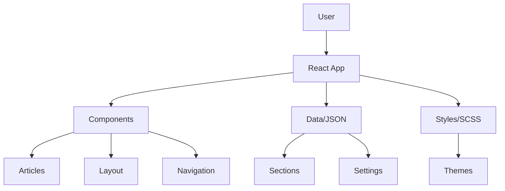

# Thomas Butler - Commercial Portfolio

<div align="center">


  
  <h3>Full-Stack Developer | Liverpool, England</h3>
  
  [](https://www.thomasjbutler.me/)
  [](https://github.com/ThomasJButler)
  [](https://www.linkedin.com/in/thomasbutleruk/)

</div>

---

## Overview

Welcome to my commercial portfolio! This is more than just a CV - it's a showcase of my journey as a web developer with **3+ years of experience** in full-stack development. Built with React and powered by the latest v2.0 template architecture, this portfolio demonstrates my expertise in modern web technologies and commitment to clean, performant code.

[](https://github.com/ThomasJButler/Commercial-Portfolio-React/actions)
[](https://opensource.org/licenses/MIT)
[](https://nodejs.org)
[](https://reactjs.org)

### Tech Stack
- **Frontend**: React, JavaScript, SCSS, HTML5/CSS3
- **Backend**: Node.js, .NET, C#
- **Cloud**: Azure, AWS
- **CMS**: HubSpot, Umbraco
- **Tools**: Git, Vite, TypeScript
- **AI/ML**: PyTorch, TensorFlow, Python

## Features

- **Modern Design**: Clean, minimalist Apple-inspired aesthetic
- **Fully Responsive**: Optimized for all devices and screen sizes
- **Performance First**: Lazy loading, optimized assets, 90+ Lighthouse score
- **Theme Switching**: Elegant light/dark mode with smooth transitions
- **SEO Optimized**: Full meta tags and structured data
- **Accessible**: WCAG compliant with semantic HTML
- **Multi-language**: Support for EN, ES, FR, JA, RU, and more

## Acknowledgments

This portfolio is built upon the excellent [React Portfolio Template](https://github.com/ryanbalieiro/react-portfolio-template) by **Ryan Balieiro**. I've extensively customized and migrated it to v2.0 while adding personal touches and improvements.

### Special Thanks
- Ryan Balieiro for the original template
- All my clients who provided testimonials
- The open-source community


## Portfolio Highlights

### Web Agency Projects
- **M&S Bank Arena** - Enterprise venue management system
- **Merseyrail** - Public transport information platform
- **CDW** - Technology solutions provider website
- **ACC Liverpool** - Convention center digital presence

### Freelance Work
- **KC Roofing and Building** - Local business transformation
- **Annabel Butler Designs** - E-commerce creative portfolio

### Personal Projects
- **AiTomatic** - AI integration showcase
- **Matrix Arcade** - Interactive gaming experience
- **Personal Portfolio** - Hand-crafted from scratch

## 🏗️ Architecture

### System Architecture



## Project Structure

```
commercial-portfolio-react/
├── public/
│   ├── data/           # JSON content files
│   │   ├── sections/   # Page section data
│   │   ├── settings.json
│   │   └── strings.json
│   └── images/         # Static assets
├── src/
│   ├── components/     # React components
│   ├── hooks/          # Custom React hooks
│   ├── styles/         # SCSS styles
│   └── main.jsx        # Entry point
├── docs/               # Documentation
└── package.json
```

## Performance

<div align="center">
  
| Metric | Score |
|--------|-------|
| Performance | 95+ |
| Accessibility | 100 |
| Best Practices | 100 |
| SEO | 100 |

</div>

## 📝 License

This project is licensed under the MIT License - see the [LICENSE](LICENSE) file for details.

## Contact

**Thomas Butler**  
Liverpool, England  
dev@thomasjbutler.me  
Portfolio](https://www.thomasjbutler.me/) | [GitHub](https://github.com/ThomasJButler) | [LinkedIn](https://www.linkedin.com/in/thomasbutleruk/)

---

<div align="center">
  <p>If you found this helpful, please consider giving it a ⭐!</p>
  
  <p>Made with ❤️ by Thomas Butler</p>
</div>
