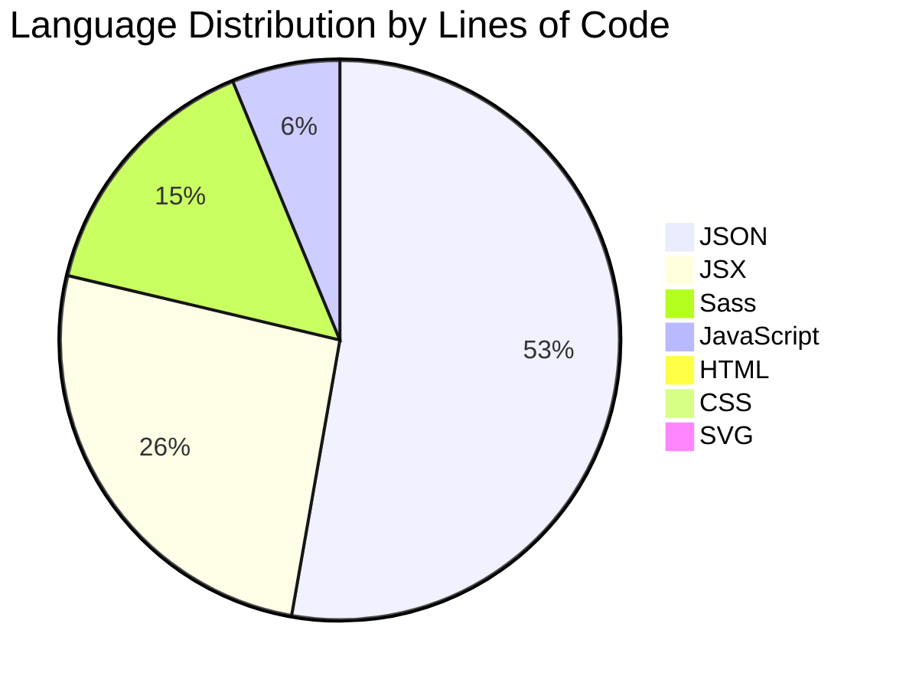

## 📊 Repository Statistics

| Metric | Value |
|--------|-------|
| **Repository Size** | 44M |
| **Total Files** | 458 |
| **Total Directories** | 80 |
| **Total Commits** | 178 |
| **Contributors** | 6 |
| **Branches** | 5 |
| **Total Lines of Code** | 24,813 |
| **Total Comments** | 2,476 |
| **Total Blank Lines** | 2,806 |

## 🔧 Technology Breakdown

| Technology | Count | Lines of Code |
|------------|-------|---------------|
| **React Components (.jsx)** | 97 | 6,424 |
| **JavaScript Files (.js)** | 31 | 1,548 |
| **JSON Data Files** | 27 | 13,067 |
| **Sass Stylesheets (.scss)** | 87 | 3,726 |
| **CSS Files** | 1 | 5 |
| **Markdown Documentation** | 25 | N/A |

## 📦 Dependencies

| Type | Count |
|------|-------|
| **Production Dependencies** | 9 |
| **Development Dependencies** | 11 |

## 🔍 Code Analysis

| Pattern | Occurrences |
|---------|-------------|
| **React Hooks Usage** | 1,773 |
| **Console.log Statements** | 8 |
| **TODO Comments** | 2 |
| **FIXME Comments** | 0 |

## 🏆 Largest Files

1. `package-lock.json` - 5,457 lines
2. `public/data/sections/updates.json` - 1,553 lines
3. `public/data/sections/demo.json` - 1,210 lines

## 📈 Language Distribution

## 🎯 Key Insights

- **Data-Driven Portfolio**: With 13,067 lines of JSON (52.7% of codebase), this is a highly data-driven portfolio application
- **React-Heavy**: 97 JSX components totaling 6,424 lines show extensive React component architecture
- **Well-Styled**: 87 Sass files (3,726 lines) indicate comprehensive custom styling
- **Highly Interactive**: 1,773 React hook usages suggest rich interactivity and state management
- **Well-Documented**: 25 Markdown files provide extensive documentation
- **Clean Code**: Only 8 console.log statements and 2 TODOs indicate clean, production-ready code
- **Collaborative**: 6 contributors across 178 commits show active development

This appears to be a sophisticated, professional portfolio application with extensive customization capabilities, comprehensive documentation, and clean architecture!